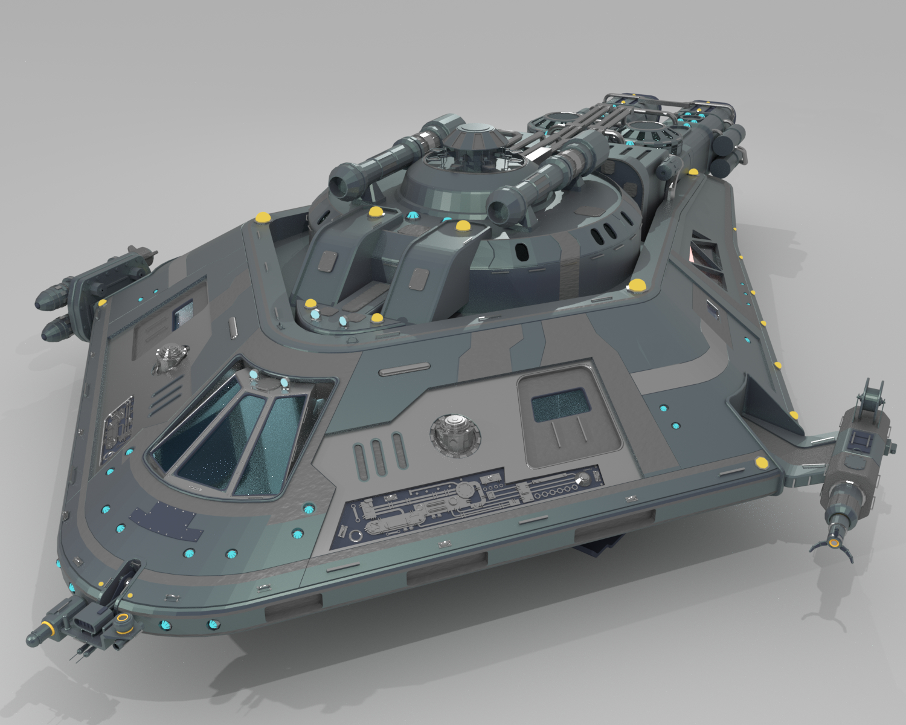
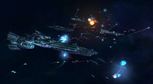
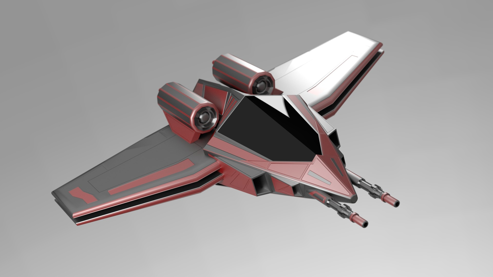

# New-Game-Engines-2-Project
Spaceship Assignment Scenes or story

My CA will create a scene in which you are a civilian ship which will be intersepted by a group of mercenary space craft who try to take control of the ship and a space chase insues, after avoiding the nearby space debris. You fight to save your life and survive. 

Description of the assignment:
The assignment takes place in a battle between you and your battalion against pirates trying to attack.
The assignment contains AI behaviors with coded state machines unique for both the enemy AI and the civilian NPCs.
Both AI and the player contain steering behaviors containing Yaw, Pitch, Roll and forward momentum.
The scene is a classic space battle in an asteroid that both you and the enemies have to avoid. The player can also destroy the enemies using a simple damage combat system the player can fire along with shields for the friendly NPC.

Instructions:
The instructions are simple you are dropped in the battle immediately and you have destroy the enemy ships.
Controls are for the player only:
Mouse for look untilizing the Yaw and Pitch built into the look controls locked to the camera.
Q and E keys make the player ship roll in the players chosen direction. 
R and F rise and fall the ship within the space and left click to fire missiles at the asteroids and enemy ships.
Space bar also creates extra velocity in the ship at the cost of over extending shooting the ship but controls can be made tight again pressing space bar again.

How it Works:
All AI are built with a pitch, yaw and roll aswell as a raycast to detect the asteroids built with a follow and attack ship with tags of which faction each AI are. Therefore the enemy AI chase the AI of player faction and chases on sight of the player faction.
The AI also has a built in success and fail rate of avoiding the asteroids and crashing, so 10% of the time when executing their turn they fail and hit the asteroid taking damage.
The damage system has three tried environmental shield and hulk damage all asteroids do standard damage, lasers do large damage to shields and lasers do little damage on hull or the base ships.
The steering bahviour is done by reading the distance between the asteroid and the AI and accessing the AI controller script to execute the best turning maneuvers needed to avoid the obstacle (seen in obstacle avoidance script) 

What I am most proud of:
What I am most proud of is the way in which the AI move and switch elegantly added with the particles system and trial gives it a cool and unique artsyle while still showing the coding happening in motion.
I am most happy with the way in which I can interchange this code and creat while star systems using these nearly aquires AI behaviors and I'm excited to have them as a useful tool for future projects.
